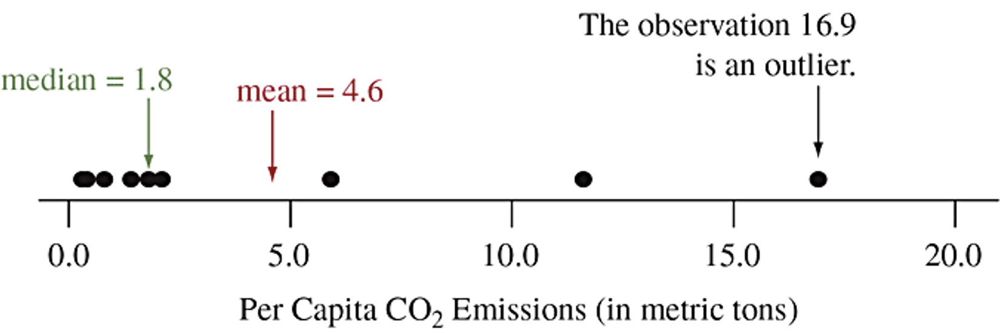
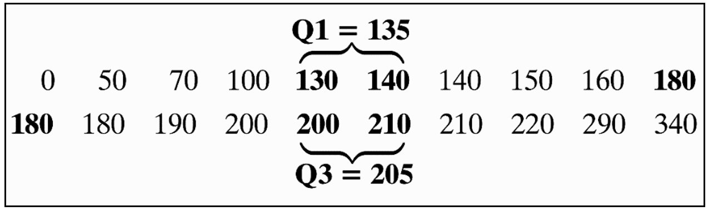

<!doctype html>
<html lang="en" class="no-js">
  <head>
    

<meta charset="utf-8">


<!-- begin SEO -->


<title>Chapter 2   Learning Strategies</title>


<meta property="og:locale" content="en-US">
<meta property="og:site_name" content="Learning Strategies">
<meta property="og:title" content="Chapter 2">


  <link rel="canonical" href="http://localhost:4000/files/Slides/Chapter%202/Section%202.1%20Examining%20Numerical%20Data/Section2.1-ExaminingNumericalData.rmd">
  <meta property="og:url" content="http://localhost:4000/files/Slides/Chapter%202/Section%202.1%20Examining%20Numerical%20Data/Section2.1-ExaminingNumericalData.rmd">


  

  


  <script type="application/ld+json">
    {
      "@context" : "http://schema.org",
      "@type" : "Person",
      "name" : "BPR Project",
      "url" : "http://localhost:4000",
      "sameAs" : null
    }
  </script>


<!-- end SEO -->


<link href="http://localhost:4000/feed.xml" type="application/atom+xml" rel="alternate" title="Learning Strategies Feed">

<!-- http://t.co/dKP3o1e -->
<meta name="HandheldFriendly" content="True">
<meta name="MobileOptimized" content="320">
<meta name="viewport" content="width=device-width, initial-scale=1.0">

<script>
  document.documentElement.className = document.documentElement.className.replace(/\bno-js\b/g, '') + ' js ';
</script>

<!-- For all browsers -->
<link rel="stylesheet" href="http://localhost:4000/assets/css/main.css">

<meta http-equiv="cleartype" content="on">
    

<!-- start custom head snippets -->

<link rel="apple-touch-icon" sizes="57x57" href="http://localhost:4000/images/apple-touch-icon-57x57.png?v=M44lzPylqQ">
<link rel="apple-touch-icon" sizes="60x60" href="http://localhost:4000/images/apple-touch-icon-60x60.png?v=M44lzPylqQ">
<link rel="apple-touch-icon" sizes="72x72" href="http://localhost:4000/images/apple-touch-icon-72x72.png?v=M44lzPylqQ">
<link rel="apple-touch-icon" sizes="76x76" href="http://localhost:4000/images/apple-touch-icon-76x76.png?v=M44lzPylqQ">
<link rel="apple-touch-icon" sizes="114x114" href="http://localhost:4000/images/apple-touch-icon-114x114.png?v=M44lzPylqQ">
<link rel="apple-touch-icon" sizes="120x120" href="http://localhost:4000/images/apple-touch-icon-120x120.png?v=M44lzPylqQ">
<link rel="apple-touch-icon" sizes="144x144" href="http://localhost:4000/images/apple-touch-icon-144x144.png?v=M44lzPylqQ">
<link rel="apple-touch-icon" sizes="152x152" href="http://localhost:4000/images/apple-touch-icon-152x152.png?v=M44lzPylqQ">
<link rel="apple-touch-icon" sizes="180x180" href="http://localhost:4000/images/apple-touch-icon-180x180.png?v=M44lzPylqQ">
<link rel="icon" type="image/png" href="http://localhost:4000/images/favicon-32x32.png?v=M44lzPylqQ" sizes="32x32">
<link rel="icon" type="image/png" href="http://localhost:4000/images/android-chrome-192x192.png?v=M44lzPylqQ" sizes="192x192">
<link rel="icon" type="image/png" href="http://localhost:4000/images/favicon-96x96.png?v=M44lzPylqQ" sizes="96x96">
<link rel="icon" type="image/png" href="http://localhost:4000/images/favicon-16x16.png?v=M44lzPylqQ" sizes="16x16">
<link rel="manifest" href="http://localhost:4000/images/manifest.json?v=M44lzPylqQ">
<link rel="mask-icon" href="http://localhost:4000/images/safari-pinned-tab.svg?v=M44lzPylqQ" color="#000000">
<link rel="shortcut icon" href="/images/favicon.ico?v=M44lzPylqQ">
<meta name="msapplication-TileColor" content="#000000">
<meta name="msapplication-TileImage" content="http://localhost:4000/images/mstile-144x144.png?v=M44lzPylqQ">
<meta name="msapplication-config" content="http://localhost:4000/images/browserconfig.xml?v=M44lzPylqQ">
<meta name="theme-color" content="#ffffff">
<link rel="stylesheet" href="http://localhost:4000/assets/css/academicons.css"/>

<script type="text/x-mathjax-config"> MathJax.Hub.Config({ TeX: { equationNumbers: { autoNumber: "all" } } }); </script>
<script type="text/x-mathjax-config">
  MathJax.Hub.Config({
    tex2jax: {
      inlineMath: [ ['$','$'], ["\\(","\\)"] ],
      processEscapes: true
    }
  });
</script>
<script src='https://cdnjs.cloudflare.com/ajax/libs/mathjax/2.7.4/latest.js?config=TeX-MML-AM_CHTML' async></script>

<!-- end custom head snippets -->

  </head>

  <body>

    <!--[if lt IE 9]>
<div class="notice--danger align-center" style="margin: 0;">You are using an <strong>outdated</strong> browser. Please <a href="http://browsehappy.com/">upgrade your browser</a> to improve your experience.</div>
<![endif]-->
    

<div class="masthead">
  <div class="masthead__inner-wrap">
    <div class="masthead__menu">
      <nav id="site-nav" class="greedy-nav">
        <button><div class="navicon"></div></button>
        <ul class="visible-links">
          <li class="masthead__menu-item masthead__menu-item--lg"><a href="http://localhost:4000/">Learning Strategies</a></li>
          
            
            <li class="masthead__menu-item"><a href="http://localhost:4000/syllabus/">Syllabus</a></li>
          
            
            <li class="masthead__menu-item"><a href="http://localhost:4000/slides/">Slides</a></li>
          
            
            <li class="masthead__menu-item"><a href="http://localhost:4000/labs/">Statistical Computing Labs</a></li>
          
            
            <li class="masthead__menu-item"><a href="http://localhost:4000/tutorials/">R Tutorials</a></li>
          
            
            <li class="masthead__menu-item"><a href="http://localhost:4000/dap/">Data Analysis Project</a></li>
          
            
            <li class="masthead__menu-item"><a href="http://localhost:4000/workshop/">Faculty Workshop</a></li>
          
            
            <li class="masthead__menu-item"><a href="http://localhost:4000/manual/">Implementation Manual</a></li>
          
            
            <li class="masthead__menu-item"><a href="http://localhost:4000/research/">Research/Publication</a></li>
          
        </ul>
        <ul class="hidden-links hidden"></ul>
      </nav>
    </div>
  </div>
</div>

    


<div id="main" role="main">
  


  <div class="sidebar sticky">
  


<div itemscope itemtype="http://schema.org/Person">

  <div class="author__avatar">
    
    	
    
  </div>

  <div class="author__content">
    <h3 class="author__name">BPR Project</h3>
    
  </div>

  <div class="author__urls-wrapper">
    <button class="btn btn--inverse">Follow</button>
    <ul class="author__urls social-icons">
      
      
      
      
      
       
      
      
      
      
      
      
      
      
      
        <li><a href="https://github.com/IntroToStatNCAT/BPRProject.github.io"><i class="fab fa-fw fa-github" aria-hidden="true"></i> Github</a></li>
      
      
      
      
      
      
      
      
      
      
      
      
      
      
      
      
      
      
    </ul>
  </div>
</div>

  
  </div>


  <article class="page" itemscope itemtype="http://schema.org/CreativeWork">
    <meta itemprop="headline" content="Chapter 2">
    
    
    

    <div class="page__inner-wrap">
      
        <header>
          <h1 class="page__title" itemprop="headline">Chapter 2
</h1>
          
        
        
        
        
             
        
    
        </header>
      

      <section class="page__content" itemprop="text">
        ```{r setup, include=FALSE}
knitr::opts_chunk$set(echo = FALSE)
```

```{r, echo=F, message=F, warning=F}
library(readr)
library(openintro)
library(datasets)
library(tidyverse)
library(scales)
data(COL)
```


# Examining numerical data

## Scatterplot

**Scatterplots** are useful for visualizing the relationship between two numerical variables.

\begin{multicols}{2}

\alert{Do life expectancy and total fertility appear to be \textbf{associated} or \textbf{independent}?}

\alert{Was the relationship the same throughout the years, or did it change?}

\columnbreak

\includegraphics[width=1\columnwidth]{life_exp_child.png}

\end{multicols}

## Scatterplot

**Scatterplots** are useful for visualizing the relationship between two numerical variables.

\begin{multicols}{2}

\alert{Do life expectancy and total fertility appear to be \textbf{associated} or \textbf{independent}?}

They appear to be linearly and negatively associated: as fertility increases, life expectancy decreases.

\alert{Was the relationship the same throughout the years, or did it change?}

The relationship changed over the years

\columnbreak

\includegraphics[width=1\columnwidth]{life_exp_child.png}

\end{multicols}

## Dot plots

Useful for visualizing one numerical variable. Darker colors represent areas where there are more observations.

```{r, echo=F, message=F, warning=F, out.width="75%",fig.align='center', include=F}
d = read.csv("dataset/gpa.csv")

gpa = d$gpa[d$gpa <= 4]
gpa = gpa[!is.na(gpa)]

openintro::dotPlot(gpa, pch = 19, col = COL[1,4], xlab = "GPA", xlim = c(2.5,4), ylab = "")
# The plot is a stretched vertically. So we use the included plot pdf
```


\alert{How would you describe the distribution of GPAs in this data set? Make sure to say something about the center, shape, and spread of the distribution.}

## Dot plots \& mean

```{r, echo=F, message=F, warning=F,fig.align='center', include=F}
openintro::dotPlot(gpa, pch = 19, col = COL[1,4], xlab = "GPA", xlim = c(2.5,4), ylab = "")
M <- mean(d$gpa[d$gpa <= 4], na.rm = TRUE)
polygon(M + c(-2,2,0)*0.01, c(0.25, 0.25, 0.5), border=COL[4], col=COL[4])

# The plot is a stretched vertically. So we use the included plot pdf
```


- The **mean**, also called the **average** (marked with a triangle in the above plot), is one way to measure the center of a **distribution** of data.

- The mean GPA is 3.59.

## Mean

- The **sample mean**, denoted as **$\bar{x}$**, can be calculated as \newline \begin{align*}\bar{x} = \frac{x_1+x_2+ \dots + x_n}{n},\end{align*} \newline where $x_1+x_2+ \dots + x_n$ represent the **n** observed values.

- The **population mean** is also computed the same way but is denotes as **$\mu$**. It is often not possible to calculate $\mu$ since population data are rarely available.

- The sample mean is a **sample statistic**, and served as a **point estimate** of the population mean. This estimate may not be perfect, but if the sample is good (representative of the population), it is usually a pretty good estimate.

## Stacked dot plot

Higher bars represent areas where there are more observations, makes it a little easier to judge the center and the shape of the distribution.

```{r, echo=F, message=F, warning=F, out.width="75%",fig.align='center'}
X <- c()
Y <- c()
for(i in 1:length(gpa)){
	x   <- gpa[i]
	rec <- sum(gpa == x)
	X   <- append(X, rep(x, rec))
	Y   <- append(Y, 1:rec)
}

radius  <- 0.0249
cex     <- 2.5
seed    <- 1
stacks  <- dotPlotStack(gpa, radius=radius, addDots=FALSE, pch=19, col=COL[1], cex=1.25, seed=seed)
plot(0, type="n", xlab="GPA", axes=FALSE, ylab="", cex.lab = 2, xlim=c(2.6, 4.0), ylim=c(0, quantile(stacks[[3]], 0.994)))

dotPlotStack(gpa, radius=radius, pch=19, col=COL[1], cex=cex, seed=seed)
abline(h=0)
axis(1, cex.axis = 2)
```

## Histograms - Extracurricular hours

- Histogram provide a view of the **data density**. Higher bars represent where the data are relatively more common.

- Histograms are especially convenient for describing the **shape** of the data distribution.

- The chosen **bin width** can alter the story the histogram is telling.

```{r, echo=F, message=F, warning=F, out.width="75%",fig.align='center'}
d = read.csv("dataset/extracurr_hrs.csv")

extracurr_hrs = d$extracurr_hrs[!is.na(d$extracurr_hrs)]
```

```{r, echo=F, message=F, warning=F, out.width="75%",fig.align='center'}
histPlot(extracurr_hrs, col = COL[1], xlab = "Hours / week spent on extracurricular activities", ylab = "",cex.lab=2,cex.axis=2)
```

## Bin width

\alert{Which one(s) of these histograms are useful? Which reveals too much about the data? Which hides too much?}

\begin{multicols}{2}

```{r, echo=F, message=F, warning=F, out.width="90%",fig.align='center'}
histPlot(extracurr_hrs, col = COL[1], xlab = "Hours / week spent on extracurricular activities", ylab = "", breaks = 2,cex.lab=3,cex.axis=2)
```

  \columnbreak

```{r, echo=F, message=F, warning=F, out.width="90%",fig.align='center'}
histPlot(extracurr_hrs, col = COL[1], xlab = "Hours / week spent on extracurricular activities", ylab = "",cex.lab=3,cex.axis=2)
```

\end{multicols}


\begin{multicols}{2}

```{r, echo=F, message=F, warning=F, out.width="90%",fig.align='center'}
histPlot(extracurr_hrs, col = COL[1], xlab = "Hours / week spent on extracurricular activities", ylab = "", breaks = 20,cex.lab=3,cex.axis=2)
```

  \columnbreak

```{r, echo=F, message=F, warning=F, out.width="90%",fig.align='center'}
histPlot(extracurr_hrs, col = COL[1], xlab = "Hours / week spent on extracurricular activities", ylab = "", breaks = 30,cex.lab=3,cex.axis=2)
```

\end{multicols}

## Shape of the distribution: modality

\alert{Does the histogram have a single prominent peak (\textbf{unimodal}), several prominent peaks (\textbf{bimodal/multimodal}), or no apparent peaks (\textbf{uniform})?}

```{r, echo=F, message=F, warning=F,fig.width=6, fig.height=1.5,fig.align='center'}
set.seed(51)
x1 <- rchisq(65, 6)
x2 <- c(rchisq(22, 5.8), rnorm(40, 16.5, 2))
x3 <- c(rchisq(20, 3), rnorm(35, 12), rnorm(42, 18, 1.5))
x4 <- runif(100,0,20)

par(mfrow=c(1,4), mar=c(1.9, 2, 1, 2), mgp=c(2.4, 0.7, 0))

histPlot(x1, axes=FALSE, xlab='', ylab='', col=COL[1])
axis(1)
axis(2)

histPlot(x2, axes=FALSE, xlab='', ylab='', col=COL[1])
axis(1)
axis(2)

histPlot(x3, axes=FALSE, xlab='', ylab='', col=COL[1])
axis(1)
axis(2)

histPlot(x4, axes=FALSE, xlab='', ylab='', col=COL[1])
axis(1)
axis(2)
```

\noindent\rule{3cm}{0.4pt}

\alert{Note:} In order to determine modality, step back and imagine a smooth curve over the histogram - imagine that the bars are wooden blocks and you drop a limp spaghetti over them, the shape the spaghetti would take could be viewed as a smooth curve.


## Shape of the distribution: skewness

\alert{Is the histogram \textbf{right skewed}, \textbf{left skewed}, or \textbf{symmetric}?}

```{r, echo=F, message=F, warning=F,fig.width=6, fig.height=3,fig.align='center'}
set.seed(234)
x1 <- rchisq(65, 3)
x2 <- c(runif(20, 0,10), rnorm(100, 16.5, 2))
x3 <- rnorm(100, 35, 12)

par(mfrow=c(1,3), mar=c(1.9, 2, 1, 2), mgp=c(2.4, 0.7, 0))

histPlot(x1, axes=FALSE, xlab='', ylab='', col=COL[1])
axis(1)
axis(2)

histPlot(x2, axes=FALSE, xlab='', ylab='', col=COL[1])
axis(1)
axis(2)

histPlot(x3, axes=FALSE, xlab='', ylab='', col=COL[1])
axis(1)
axis(2)
```

\noindent\rule{3cm}{0.4pt}

\alert{Note:} Histograms are said to be skewed to the side of the long tail.

## Shape of the distribution: unusual observations

\alert{Are there any unusual observations or potential \textbf{outliers}?}

```{r, echo=F, message=F, warning=F,fig.width=6, fig.height=3,fig.align='center'}
set.seed(195)
x1 <- c(rchisq(65, 3), 20)
x2 <- c(rnorm(100, 35, 10), rnorm(3, 100,3))

par(mfrow=c(1,2), mar=c(1.9, 2, 1, 2), mgp=c(2.4, 0.7, 0))

histPlot(x1, axes=FALSE, xlab='', ylab='', col=COL[1])
axis(1)
axis(2)

histPlot(x2, axes=FALSE, xlab='', ylab='', col=COL[1])
axis(1)
axis(2)
```


## Extracurricular activities

\alert{How would you describe the shape of the distribution of hours of week students spend on extracurricular acitivities?}

```{r, echo=F, message=F, warning=F, out.width="70%",fig.align='center'}
histPlot(extracurr_hrs, col = COL[1], xlab = "Hours / week spent on extracurricular activities", ylab = "",cex.lab=2.5,cex.axis=2)
```

\pause

Unimodal and right skewed, with a potentially unusual observation at 60 hours/week.


## Commonly observed shapes of distributions

- Modality

\begin{multicols}{4}

Unimodal
\includegraphics[width=1\columnwidth]{unimodal.png}

\pause

\columnbreak

Bimodal
\includegraphics[width=1\columnwidth]{bimodal.png}

\pause

\columnbreak

Multimodal
\includegraphics[width=1\columnwidth]{multimodal.png}

\pause

\columnbreak

uniform
\includegraphics[width=1\columnwidth]{uniform.png}

\pause

\end{multicols}

- Skewness

\begin{multicols}{3}

Right Skew
\includegraphics[width=1\columnwidth]{right_skew.png}

\pause

\columnbreak

Left Skew
\includegraphics[width=1\columnwidth]{left_skew.png}

\pause

\columnbreak

Symmetric
\includegraphics[width=1\columnwidth]{symmetric.png}

\end{multicols}


## Practice

\alert{Which of these variables do you expect to be uniformly distributed?}

A) Weights of adult females
B) Salaries of a random sample of people from North Carolina
C) House prices
D) Birthdays of classmates (days of the month)

## Practice

\alert{Which of these variables do you expect to be uniformly distributed?}

A) Weights of adult females
B) Salaries of a random sample of people from North Carolina
C) House prices
D) \alert{Birthdays of classmates (days of the month)}

## Application activity: Shapes of distributions

Sketch the expected distribution of the following variables:

  - Number of piercings
  - Scores on an exam
  - IQ scores

Come up with a concise way (1-2 sentences) to teach someone how to determine the expected distribution of any variable.

## Are you typical


[https://youtu.be/4B2xOvKFFz4](https://youtu.be/4B2xOvKFFz4)

## Are you typical


[https://youtu.be/4B2xOvKFFz4](https://youtu.be/4B2xOvKFFz4)

\alert{How useful are centers alone for conveying the true characteristics of a distribution?}


## Variance

**Variance** is roughly the average squared deviation from the mean.

\begin{center}

$s^2 = \frac{\sum_{i=1}^{n}(x_i-\bar{x})^2}{n-1}$

\end{center}

\pause

\begin{multicols}{2}

\begin{itemize}

\item The sample mean is $\bar{x} = 6.71,$ and the sample size is $n = 217.$

\item The variance of amount of sleep students get per night can be calculated as:

\end{itemize}

\columnbreak

```{r, echo=F, message=F, warning=F, out.width="100%",fig.align='center'}

d = read.csv("dataset/sleep.csv")

sleep = d$sleep[!is.na(d$sleep)]

# hist
histPlot(sleep, col = COL[1], xlab = "Hours of sleep / night", ylab = "", cex.lab=2)
```

\end{multicols}

\pause

\begin{center}

$s^2 = \frac{(5-6.71)^2+(9-6.71)^2+\dots+(7-6.71)^2}{217-1} = 4.11 \text{ } hours^2$

\end{center}

## Variance

\alert{Why do we use the squared deviation in the calculation of variance?}

\pause

- To get rid of negatives so that observations equally distant from the mean are weighed equally.

- To weigh larger deviations more heavily.


## Standard Deviation

The **standard deviation** is the square root of the variance, and has the same units as the data.

\begin{center}

$s = \sqrt{s^2}$

\end{center}

\pause

\begin{multicols}{2}

\begin{itemize}

\item The standard deviation of amount of sleep students get per night can be calculated as:

\begin{center}

$s = \sqrt{4.11} = 2.03 \text{ } hours$

\end{center}

\item We can see that all of the data are within 3 standard deviations of the mean.

\end{itemize}

\columnbreak

```{r, echo=F, message=F, warning=F, out.width="100%",fig.align='center'}
histPlot(sleep, col = COL[1], xlab = "Hours of sleep / night", ylab = "", cex.lab=2)
```

\end{multicols}

## Standard Deviation

The **standard deviation** is the square root of the variance $s^2$, and has the same units as the data.

$$s=\sqrt{\frac{\sum_{i=1}^{n}(x_i-\bar{x})^2}{n-1}}$$

Example: The following are samples of women’s and men’s ideal number of children. Find the standard deviation for each group.

\begin{center} Men: 0, 0, 0, 2, 4, 4, 4  \ \ \ Women: 0, 2, 2, 2, 2, 2, 4\end{center}

**Answer**: The mean for men is $\bar{x}=14/7=2$ and the standard deviation is
$$s=\sqrt{\frac{\sum_{i=1}^{n}(x_i-\bar{x})^2}{n-1}}=\sqrt{\frac{(0-2)^2+\cdots+(4-2)^2}{7-1}}=\sqrt{\frac{24}{6}}=2.0$$

  - Similarly, the mean for women is $\bar{x}=14/7=2$ and the standard deviation is $s=1.2$ children.

## Standard Deviation

- The standard deviation is the typical deviation of an observation from the mean.

- The _larger_ the value of standard deviation, $s$, the _greater_ the variability of the data. As the spread of the data increases, $s$ gets larger.

- Unlike the variance which has squared units, the standard deviation has the same units of measurement as the original observations.

- The standard deviation is zero ($s=0$) only when all observations have the same value, otherwise $s>0$. 

- The standard deviation $s$ is less than the variance $s^2$ unless $s^2$ is smaller than 1.

- The standard deviation $s$ is not resistant. That is, strong skewness or a few outliers can greatly increase $s$.

## Median

- The **median** is the value that splits the data in half when ordered in ascending order.

\begin{center}

$0, 1, \textbf{2}, 3, 4$

\end{center}

- If there are an even number of observations, then the median is the average of the two values in the middle.

\begin{center}

$0, 1, \underline{2, 3}, 4, 5 \rightarrow \frac{2+3}{2} = \textbf{2.5}$

\end{center}

- Since the median is the midpoint of the data, 50\% of the values are below it. Hence, it is also the $\bm{50^{\textbf{th}}}$ **percentile**.

## Median

- The **median** is the value that splits the data in half when ordered in ascending order.

- Example: the data below gives the per capita CO~2~ emissions in 9 largest nations measured in metric tons per person. Find the value of the median.

\begin{center} China 5.9; India 1.4; U.S. 16.9; Indonesia 1.8; Brazil 2.1; Pakistan 0.8; Nigeria 0.3; Bangladesh 0.4; Russia 11.6 \end{center}

**Solution:**

- First, put the $n=9$ observations in order of their size.
$0.3, 0.4, 0,8, 1.4, 1.8, 2.1, 5.9, 11.6, 16.9$

- Since $n=9$ is odd, the median is the middle observation: median $=1.8$ metric tons.

## Median

- The **median** is the value that splits the data in half when ordered in ascending order.

- Unlike the mean, the _median_ is a **resistant measure** as its value is not sensitive to outliers.



- If we drop out the U.S. value, what is the new median? 
  - Now $n=8$ is even and the ordered values are: $0.3, 0.4, 0,8, 1.4, 1.8, 2.1, 5.9, 11.6$
  - The median is the average of the two middle observations: median $=(1.4+1.8)/2=1.6$ 
  
## Q1, Q3, and IQR

- The $25^{th}$ percentile is also called the first quartile, **Q1**.

- The $50^{th}$ percentile is also called the median.

- The $75^{th}$ percentile is also called the third quartile, **Q3**.

- Between Q1 and Q3 is the middle 50\% of the data. The range these data span is called the **interquartile range**, or the **IQR**.

\begin{center}

$IQR = Q3-Q1$

\end{center}

## Q1, Q3, and IQR

\textcolor{blue}{Finding Quartiles}

- Arrange the data in order.

- Consider the median. This is the second quartile, Q~2~.

- Consider the lower half of the observations (excluding the median itself if $n$ is odd). The median of these observations is the first quartile, Q~1~.

- Consider the upper half of the observations (excluding the median itself if $n$ is odd). Their median is the third quartile, Q~3~.

## Q1, Q3, and IQR

Example: Consider the following sodium values in 20 brands of breakfast cereals. The sodium values, in ascending order, are:



What are the quartiles and IQR for the 20 cereal sodium values?

- The median of the 20 values is the average of the 10th and 11th observations, 180 and 180, which is Q~2~ = 180 mgs.
- The first quartile Q~1~ is the median of the 10 smallest values, which is the average of 130 & 140, Q~1~ = 135 mgs.
- The third quartile Q~3~ is the median of the 10 largest values, which is the average of 200 & 210, Q~3~ = 205 mgs.

## Q1, Q3, and IQR

Example: Consider the following sodium values in 20 brands of breakfast cereals. The sodium values, in ascending order, are:


- The interquartile range (IQR) is the distance between the third quartile and first quartile: $$IQR=Q_3 - Q_1 = 205-135=70$$
This means that the middle 50% of the distribution of sodium amount stretches over a distance of 70.

## The Five-Number Summary

- The **five-number summary** is a numerical descriptive summary of the distribution of the data and it consists of the following: 

  - Minimum value
  - First Quartile (Q~1~)
  - Median (Q~2~)
  - Third Quartile (Q~3~)
  - Maximum value

- The **five-number summary** is the basis of a graphical display called the _box plot_.

## Box Plot

The box in a **box plot** represents the middle 50\% of the data, and the thick line in the box is the median.

```{r, echo=F, message=F, warning=F, out.width="90%",fig.align='center'}
d = read.csv("dataset/study_hours.csv")

study_hours = d$study_hours[!is.na(d$study_hours)]

# box

boxPlot(study_hours, col = COL[1,3], ylab = "# of study hours / week")
```

## Anatomy of a box plot

```{r, echo=F, message=F, warning=F, out.width="90%",fig.align='center'}
# layout

par(mar=c(0.8,4,0,1), mgp=c(2.8, 0.7, 0), las=1)

boxPlot(study_hours, col = COL[1,3], ylab = "# of study hours / week", axes=FALSE, xlim = c(0,3.5), pch = 20)
axis(2)

arrows(2,0, 1.40,min(study_hours)-0.5, length=0.08)
text(2,0.5,'lower whisker', pos=4, cex=1.5)

arrows(2, 8, 1.40, quantile(study_hours, 0.25), length=0.08)
text(2,8,expression(Q[1]~~'(first quartile)'), pos=4, cex=1.5)

m <- median(study_hours)
arrows(2, m, 1.40, m, length=0.08)
text(2,m,'median', pos=4, cex=2)

q <- quantile(study_hours, 0.75)
arrows(2, q, 1.40, q, length=0.08)
text(2,q,expression(Q[3]~~'(third quartile)'), pos=4, cex=1.5)

arrows(2, 35, 1.40, 35, length=0.08)
text(2,35,'max whisker reach\n& upper whisker', pos=4, cex=1.5)

arrows(2, 47, 1.40, 45, length=0.08)
arrows(2, 47, 1.40, 49, length=0.08)
text(2,47,'suspected outliers', pos=4, cex=1.5)

points(rep(0.4, 99), rev(sort(study_hours))[1:99], cex=rep(2, 27), col=rep(COL[1,3], 99), pch=rep(20, 99))
points(rep(0.4, 99), sort(study_hours)[1:99], cex=rep(2, 27), col=rep(COL[2], 99), pch=rep(1, 99))
```

## Whiskers and Outliers

- **Whiskers** of a box plot can extend up to $1.5 \times IQR$ away from the quartiles.

\begin{center}

$\text{max upper whisker reach} = Q3 \text{ }+1.5 \times IQR$

$\text{max lower whisker reach} = Q1 \text{ }-1.5 \times IQR$

\pause

$IQR: 20-10=10$

$\text{max upper whisker reach} = 20 \text{ }+1.5 \times 10 = 35$

$\text{max lower whisker reach} = 10 \text{ }-1.5 \times 10 = -5$

\end{center}

\pause

- A potential **outlier** is defined as an observation beyond the maximum reach of the whiskers. It is an observation that appears extreme relative to the rest of the data.

## Outliers

\alert{Why is it important to look for outliers?}

\pause

- Identify extreme skew in the distribution.

- Identify data collection and entry errors.

- Provide insight into interesting features of the data.

## Extreme observations

\alert{How would sample statistics such as mean, median, SD, and IQR of household income be affected if the largest value was replaced with \$10 million? What if the smallest value was replaced with \$10 million?}

```{r, echo=F, message=F, warning=F,fig.width=8, fig.height=4,fig.align='center'}
d = read.csv("dataset/house_income.csv")

house_income = d$house_income[!is.na(d$house_income) & d$house_income < 4000000]

radius  <- 20000
cex     <- 1.4
seed    <- 2
stacks  <- dotPlotStack(house_income, radius=radius, addDots=FALSE, pch=19, col=COL[1], cex=0.8, seed=seed)
plot(0, type="n", xlab="Annual Household Income", axes=FALSE, ylab="", xlim=range(house_income), ylim=c(0, quantile(stacks[[3]], 0.999)),  cex.lab=1.5)

dotPlotStack(house_income, radius=radius, pch=19, col=COL[1], cex=cex, seed=seed)
abline(h=0)
axis(1, cex.axis=1.1)
```


## Robust statistics

```{r, echo=F, message=F, warning=F, fig.width=8, fig.height=4,fig.align='center'}
radius  <- 20000
cex     <- 1.4
seed    <- 2
stacks  <- dotPlotStack(house_income, radius=radius, addDots=FALSE, pch=19, col=COL[1], cex=0.8, seed=seed)
plot(0, type="n", xlab="Annual Household Income", axes=FALSE, ylab="", xlim=range(house_income), ylim=c(0, quantile(stacks[[3]], 0.999)),  cex.lab=1.5)

dotPlotStack(house_income, radius=radius, pch=19, col=COL[1], cex=cex, seed=seed)
abline(h=0)
axis(1, cex.axis=1.1)
```

\begin{table}[]
\begin{tabular}{lcccc}
\cline{2-5}
                              & \multicolumn{2}{c}{robust} & \multicolumn{2}{c}{not robust} \\ \hline
scenario                      & median        & IQR        & $\bar{x}$      & s             \\ \hline
original data                 & 190K          & 200K       & 245K           & 226K          \\
move largest to \$10 million  & 190K          & 200K       & 309K           & 853K          \\
move smallest to \$10 million & 200K          & 200K       & 316K           & 854K          \\ \hline
\end{tabular}
\end{table}

## Robust statistics

Median and IQR are more robust to skewness and outliers than mean and SD. Therefore,

  - for skewed distributions it is often more helpful to use median and IQR to describe the center and spread.
  
  - for symmetric distributions it is often more helpful to use the mean and SD to describe the center and spread.
  
\pause
  
\alert{If you would like to estimate the typical household income for a student, would you be more interested in the mean or median income?}

\pause

Median

## Mean vs. Median

- If the distribution is symmetric, center is often defined as the mean: mean $\approx$ median.

```{r, echo=F, message=F, out.width="25%",warning=F,fig.align='center'}
set.seed(20)
par(mar=c(1,1,1,1))
sym = rnorm(10000, 0,1)
d = sym
plot(density(d), axes = FALSE, xlab = "", ylab = "", main = "Symmetric", lwd =4, cex.main=3.5, adj = 0.05, line = -2.1)
abline(h = 0, col = "gray")
box()
abline(v = mean(d), col = "blue", lty = 2, lwd = 5)
abline(v = median(d), col = "darkgreen", lty = 1, lwd = 5)
legend("topright", inset = 0.05, col = c("blue","darkgreen"), legend = c("mean","median"), lty = c(2,1), lwd = 3)
```

- If the distribution is skewed or has extreme outliers, center is often defined as the median.

  - Right\-skewed: mean > median
  - left\-skewed: mean < median
  
\begin{multicols}{2}

```{r, echo=F, message=F, out.width="50%",warning=F,fig.align='right'}
set.seed(20)
par(mar=c(1,1,1,1))
rs = rpois(10000,.5)
d = rs
plot(density(d), axes = FALSE, xlab = "", ylab = "", main = "Right-skewed", lwd=4, cex.main=3.5, line=-2.1)
abline(h = 0, col = "gray")
box()
abline(v = mean(d), col = "blue", lty = 2, lwd = 5)
abline(v = median(d), col = "darkgreen", lty = 1, lwd = 5)
legend("topright", inset = 0.05, col = c("blue","darkgreen"), legend = c("mean","median"), lty = c(2,1), lwd = 3)
```

\columnbreak

```{r, echo=F, message=F, out.width="50%",warning=F,fig.align='left'}
set.seed(20)
par(mar=c(1,1,1,1))
ls = rbeta(10000,8,0.5)
d = ls
plot(density(d), axes = FALSE, xlab = "", ylab = "", main = "Left-skewed", lwd=4, cex.main=3.5, line=-2.1)
abline(h = 0, col = "gray")
box()
abline(v = mean(d), col = "blue", lty = 2, lwd = 5)
abline(v = median(d), col = "darkgreen", lty = 1, lwd = 5)
legend("topleft", inset = 0.05, col = c("blue","darkgreen"), legend = c("mean","median"), lty = c(2,1), lwd = 3)
```

\end{multicols}
  
## Practice

\alert{Which is most likely true for the distribution of percentage of time actually spent taking notes in class versus on Facebook, Twitter etc.?}

```{r, echo=F, message=F, fig.width=8, fig.height=4,warning=F,fig.align='center'}
d = read.csv("dataset/notes_perc.csv")

notes_perc = d$notes_perc[!is.na(d$notes_perc)]

# hist

histPlot(notes_perc, col = COL[1], xlab = "% of time in class spent taking notes", ylab = "",cex.axis=3, cex.lab=1.5)
```


A) Mean > Median     C) Mean $\approx$ Median
B) Mean < Median     D) Impossible to tell

## Practice

\alert{Which is most likely true for the distribution of percentage of time actually spent taking notes in class versus on Facebook, Twitter etc.?}

```{r, echo=F, message=F, fig.width=8, fig.height=4,warning=F,fig.align='center'}
# hist

histPlot(notes_perc, col = COL[1], xlab = "% of time in class spent taking notes", ylab = "",cex.axis=3, cex.lab=1.5)
```

A) Mean > Median     C) Mean $\approx$ Median
B) \alert{Mean < Median}     D) Impossible to tell

## Extremely skewed data

When data are extremely skewed, transforming them might make modeling easier. A common transformation is the **log transformation**.

The histograms on the left shows the distribution of number of basketball games attended by students. The histogram on the right shows the distribution of log of number of games attended.

\begin{multicols}{2}

```{r, echo=F, message=F, out.width="100%",warning=F,fig.align='right'}
d = read.csv("dataset/basket_games.csv")

basket_games = d$basket_games[!is.na(d$basket_games)]

# hist

histPlot(basket_games, col = COL[1], xlab = "# of basketball games attended", ylab = "", cex.lab=2, cex.axis=2)
```

\columnbreak

```{r, echo=F, message=F, out.width="100%",warning=F,fig.align='left'}
histPlot(log(basket_games), col = COL[1], xlab = "# of basketball games attended", ylab = "", cex.lab=2, cex.axis=2)
```

\end{multicols}

## Pros and Cons of transformations

- Skewed data are easier to model with when they are transformed because outliers tend to become far less prominent after an appropriate transformation.

\begin{table}[]
\begin{tabular}{lcccc}
\# of games       & 70    & 50    & 25    & \dots     \\ 
log(\# of games)  & 4.25  & 3.91  & 3.22  & \dots     \\
\end{tabular}
\end{table}

- However, results of an analysis in log units of the measured variable might be difficult to interpret.

\pause

\alert{What other variables would you expect to be extremely skewed?}

\pause

Salary, housing prices, etc.

## Intensity maps

\alert{What patterns are apparent in the change in population between 2000 and 2010?}


[https://www.nytimes.com/projects/census/2010/map.html](https://www.nytimes.com/projects/census/2010/map.html)

        
      </section>

      <footer class="page__meta">
        
        


      </footer>

      

      


    </div>

    
  </article>

  
  
</div>


    <div class="page__footer">
      <footer>
        <!-- start custom footer snippets -->
<a href="/sitemap/">Sitemap</a>
<!-- end custom footer snippets -->

        

<div class="page__footer-follow">
  <ul class="social-icons">
    
      <li><strong>Follow:</strong></li>
    
    
    
    
      <li><a href="http://github.com/IntroToStatNCAT/BPRProject.github.io"><i class="fab fa-github" aria-hidden="true"></i> GitHub</a></li>
    
    
    <li><a href="http://localhost:4000/feed.xml"><i class="fa fa-fw fa-rss-square" aria-hidden="true"></i> Feed</a></li>
  </ul>
</div>

<div class="page__footer-copyright">&copy; 2022 BPR Project. Powered by <a href="http://jekyllrb.com" rel="nofollow">Jekyll</a> &amp; <a href="https://github.com/academicpages/academicpages.github.io">AcademicPages</a>, a fork of <a href="https://mademistakes.com/work/minimal-mistakes-jekyll-theme/" rel="nofollow">Minimal Mistakes</a>.</div>

      </footer>
    </div>

    <script src="http://localhost:4000/assets/js/main.min.js"></script>


  <script>
  (function(i,s,o,g,r,a,m){i['GoogleAnalyticsObject']=r;i[r]=i[r]||function(){
  (i[r].q=i[r].q||[]).push(arguments)},i[r].l=1*new Date();a=s.createElement(o),
  m=s.getElementsByTagName(o)[0];a.async=1;a.src=g;m.parentNode.insertBefore(a,m)
  })(window,document,'script','//www.google-analytics.com/analytics.js','ga');

  ga('create', '', 'auto');
  ga('send', 'pageview');
</script>


  </body>
</html>

