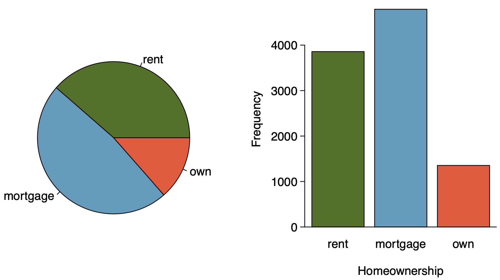

<!doctype html>
<html lang="en" class="no-js">
  <head>
    

<meta charset="utf-8">


<!-- begin SEO -->


<title>Chapter 2   Learning Strategies</title>


<meta property="og:locale" content="en-US">
<meta property="og:site_name" content="Learning Strategies">
<meta property="og:title" content="Chapter 2">


  <link rel="canonical" href="http://localhost:4000/files/Slides/Chapter%202/Section%202.2%20Considering%20Categorical%20Data/Section2.2-ConsideringCategoricalData.rmd">
  <meta property="og:url" content="http://localhost:4000/files/Slides/Chapter%202/Section%202.2%20Considering%20Categorical%20Data/Section2.2-ConsideringCategoricalData.rmd">


  

  


  <script type="application/ld+json">
    {
      "@context" : "http://schema.org",
      "@type" : "Person",
      "name" : "BPR Project",
      "url" : "http://localhost:4000",
      "sameAs" : null
    }
  </script>


<!-- end SEO -->


<link href="http://localhost:4000/feed.xml" type="application/atom+xml" rel="alternate" title="Learning Strategies Feed">

<!-- http://t.co/dKP3o1e -->
<meta name="HandheldFriendly" content="True">
<meta name="MobileOptimized" content="320">
<meta name="viewport" content="width=device-width, initial-scale=1.0">

<script>
  document.documentElement.className = document.documentElement.className.replace(/\bno-js\b/g, '') + ' js ';
</script>

<!-- For all browsers -->
<link rel="stylesheet" href="http://localhost:4000/assets/css/main.css">

<meta http-equiv="cleartype" content="on">
    

<!-- start custom head snippets -->

<link rel="apple-touch-icon" sizes="57x57" href="http://localhost:4000/images/apple-touch-icon-57x57.png?v=M44lzPylqQ">
<link rel="apple-touch-icon" sizes="60x60" href="http://localhost:4000/images/apple-touch-icon-60x60.png?v=M44lzPylqQ">
<link rel="apple-touch-icon" sizes="72x72" href="http://localhost:4000/images/apple-touch-icon-72x72.png?v=M44lzPylqQ">
<link rel="apple-touch-icon" sizes="76x76" href="http://localhost:4000/images/apple-touch-icon-76x76.png?v=M44lzPylqQ">
<link rel="apple-touch-icon" sizes="114x114" href="http://localhost:4000/images/apple-touch-icon-114x114.png?v=M44lzPylqQ">
<link rel="apple-touch-icon" sizes="120x120" href="http://localhost:4000/images/apple-touch-icon-120x120.png?v=M44lzPylqQ">
<link rel="apple-touch-icon" sizes="144x144" href="http://localhost:4000/images/apple-touch-icon-144x144.png?v=M44lzPylqQ">
<link rel="apple-touch-icon" sizes="152x152" href="http://localhost:4000/images/apple-touch-icon-152x152.png?v=M44lzPylqQ">
<link rel="apple-touch-icon" sizes="180x180" href="http://localhost:4000/images/apple-touch-icon-180x180.png?v=M44lzPylqQ">
<link rel="icon" type="image/png" href="http://localhost:4000/images/favicon-32x32.png?v=M44lzPylqQ" sizes="32x32">
<link rel="icon" type="image/png" href="http://localhost:4000/images/android-chrome-192x192.png?v=M44lzPylqQ" sizes="192x192">
<link rel="icon" type="image/png" href="http://localhost:4000/images/favicon-96x96.png?v=M44lzPylqQ" sizes="96x96">
<link rel="icon" type="image/png" href="http://localhost:4000/images/favicon-16x16.png?v=M44lzPylqQ" sizes="16x16">
<link rel="manifest" href="http://localhost:4000/images/manifest.json?v=M44lzPylqQ">
<link rel="mask-icon" href="http://localhost:4000/images/safari-pinned-tab.svg?v=M44lzPylqQ" color="#000000">
<link rel="shortcut icon" href="/images/favicon.ico?v=M44lzPylqQ">
<meta name="msapplication-TileColor" content="#000000">
<meta name="msapplication-TileImage" content="http://localhost:4000/images/mstile-144x144.png?v=M44lzPylqQ">
<meta name="msapplication-config" content="http://localhost:4000/images/browserconfig.xml?v=M44lzPylqQ">
<meta name="theme-color" content="#ffffff">
<link rel="stylesheet" href="http://localhost:4000/assets/css/academicons.css"/>

<script type="text/x-mathjax-config"> MathJax.Hub.Config({ TeX: { equationNumbers: { autoNumber: "all" } } }); </script>
<script type="text/x-mathjax-config">
  MathJax.Hub.Config({
    tex2jax: {
      inlineMath: [ ['$','$'], ["\\(","\\)"] ],
      processEscapes: true
    }
  });
</script>
<script src='https://cdnjs.cloudflare.com/ajax/libs/mathjax/2.7.4/latest.js?config=TeX-MML-AM_CHTML' async></script>

<!-- end custom head snippets -->

  </head>

  <body>

    <!--[if lt IE 9]>
<div class="notice--danger align-center" style="margin: 0;">You are using an <strong>outdated</strong> browser. Please <a href="http://browsehappy.com/">upgrade your browser</a> to improve your experience.</div>
<![endif]-->
    

<div class="masthead">
  <div class="masthead__inner-wrap">
    <div class="masthead__menu">
      <nav id="site-nav" class="greedy-nav">
        <button><div class="navicon"></div></button>
        <ul class="visible-links">
          <li class="masthead__menu-item masthead__menu-item--lg"><a href="http://localhost:4000/">Learning Strategies</a></li>
          
            
            <li class="masthead__menu-item"><a href="http://localhost:4000/syllabus/">Syllabus</a></li>
          
            
            <li class="masthead__menu-item"><a href="http://localhost:4000/slides/">Slides</a></li>
          
            
            <li class="masthead__menu-item"><a href="http://localhost:4000/labs/">Statistical Computing Labs</a></li>
          
            
            <li class="masthead__menu-item"><a href="http://localhost:4000/tutorials/">R Tutorials</a></li>
          
            
            <li class="masthead__menu-item"><a href="http://localhost:4000/dap/">Data Analysis Project</a></li>
          
            
            <li class="masthead__menu-item"><a href="http://localhost:4000/workshop/">Faculty Workshop</a></li>
          
            
            <li class="masthead__menu-item"><a href="http://localhost:4000/manual/">Implementation Manual</a></li>
          
            
            <li class="masthead__menu-item"><a href="http://localhost:4000/research/">Research/Publication</a></li>
          
        </ul>
        <ul class="hidden-links hidden"></ul>
      </nav>
    </div>
  </div>
</div>

    


<div id="main" role="main">
  


  <div class="sidebar sticky">
  


<div itemscope itemtype="http://schema.org/Person">

  <div class="author__avatar">
    
    	
    
  </div>

  <div class="author__content">
    <h3 class="author__name">BPR Project</h3>
    
  </div>

  <div class="author__urls-wrapper">
    <button class="btn btn--inverse">Follow</button>
    <ul class="author__urls social-icons">
      
      
      
      
      
       
      
      
      
      
      
      
      
      
      
        <li><a href="https://github.com/IntroToStatNCAT/BPRProject.github.io"><i class="fab fa-fw fa-github" aria-hidden="true"></i> Github</a></li>
      
      
      
      
      
      
      
      
      
      
      
      
      
      
      
      
      
      
    </ul>
  </div>
</div>

  
  </div>


  <article class="page" itemscope itemtype="http://schema.org/CreativeWork">
    <meta itemprop="headline" content="Chapter 2">
    
    
    

    <div class="page__inner-wrap">
      
        <header>
          <h1 class="page__title" itemprop="headline">Chapter 2
</h1>
          
        
        
        
        
             
        
    
        </header>
      

      <section class="page__content" itemprop="text">
        ```{r setup, include=FALSE}
knitr::opts_chunk$set(echo = FALSE)
```

```{r, echo=F, message=F, warning=F}
library(readr)
library(openintro)
library(datasets)
library(tidyverse)
library(scales)
data(COL)
```

# Considering categorical data

## Contingency tables

A table that summarizes data for two categorical variable is called a **contingency table**.

\pause

The contingency table below shows the distribution of survival and ages of passengers on the Titanic.


\begin{table}[]
\begin{tabular}{ccccc}
                     &       & \multicolumn{2}{c}{Survival} &       \\ \cline{3-4}
                     &       & Died        & Survived       & Total \\ \cline{2-5} 
\multirow{2}{*}{Age} & Adult & 1438        & 654            & 2092  \\
                     & Child & 52          & 57             & 109   \\ \cline{2-5} 
                     & Total & 1490        & 711            & 2201  \\ \cline{2-5} 
\end{tabular}
\end{table}

## Bar Plots

A **bar plot** is a common way to display a single categorical variable. A bar plot where proportions instead of the frequencies are shown is called a **relative frequency bar plot**.

\begin{multicols}{2}

```{r, echo=F, message=F, out.width="100%",warning=F,fig.align='center'}
age_survived <- apply(Titanic, c(3, 4), sum)

titanic_data <- tibble(
  Age = c(rep("Child", 52 + 57), rep("Adult", 1438 + 654)),
  Survival = c(rep("Died", 52), rep("Survived", 57), rep("Died", 1438), rep("Survived", 654))
  )

ggplot(titanic_data, aes(x = Survival)) +
  geom_bar(fill = COL[1]) +
  labs(y = "Frequency") +
  theme_bw(base_size = 25)
```

\columnbreak

```{r, echo=F, message=F, out.width="100%",warning=F,fig.align='center'}
ggplot(titanic_data, aes(x = Survival)) +
  geom_bar(aes(y = (..count..)/sum(..count..)), fill = COL[1]) +
  labs(y = "Relative frequency") +
  scale_y_continuous(labels=percent) +
  theme_bw(base_size = 25)
```

\end{multicols}

\pause

\alert{How are bar plots different than histograms?}

\pause

\footnotesize Bar plots are used for displaying distributions of categorical variables, histograms are used for numerical variables. The x\-axis in a histogram is a number line, hence the order of the bards cannot be changed. In a bar plot, the categories can be listed in any order (though some ordering make more sense than others, especially for ordinal variables.)

## Choosing the appropriate proportion

\alert{Does there appear to be a relationship between age and survival for passengers on the Titanic?}

\begin{table}[]
\begin{tabular}{ccccc}
                     &       & \multicolumn{2}{c}{Survival} &       \\ \cline{3-4}
                     &       & Died        & Survived       & Total \\ \cline{2-5} 
\multirow{2}{*}{Age} & Adult & 1438        & 654            & 2092  \\
                     & Child & 52          & 57             & 109   \\ \cline{2-5} 
                     & Total & 1490        & 711            & 2201  \\ \cline{2-5} 
\end{tabular}
\end{table}

\pause

To answer this question we examine the row proportions:

\pause

  - % Adults who survived: 654 / 2091 $\approx$ 0.31
  
\pause
  
  - % Children who survived: 57 / 109 $\approx$ 0.52
  
## Bar plots with two variables

- **Stacked bar plot:** Graphical display of contingency table information, for counts.

- **Side\-by\-side bar plot:** Displays the same information by placing bars next to, instead of on top of, each other.

- **Standardized stacked bar plot:** Graphical display of contingency table information, for proportions.

## Bar plots with two variables

\alert{What are the difference between the three visualizations shown below?}

\begin{multicols}{2}

```{r, echo=F, message=F, out.width="100%",warning=F,fig.align='center'}
ggplot(titanic_data, aes(x = Age, fill = Survival)) +
  geom_bar() +
  labs(y = "Frequency") +
  theme_bw(base_size = 25) +
  scale_fill_manual(values = c(COL[1], COL[1,3]), breaks = c("Died", "Survived"))
```

\columnbreak

```{r, echo=F, message=F, out.width="100%",warning=F,fig.align='center'}
ggplot(titanic_data, aes(x = Age, fill = Survival)) +
  geom_bar(position = "dodge") +
  labs(y = "Frequency") +
  theme_bw(base_size = 25) +
  scale_fill_manual(values = c(COL[1], COL[1,3]), breaks = c("Died", "Survived"))
```

\end{multicols}

```{r, echo=F, message=F, out.width="47%",warning=F,fig.align='center'}
ggplot(titanic_data, aes(x = Age, fill = Survival)) +
  geom_bar(position = "fill") +
  labs(y = "Relative frequency") +
  theme_bw(base_size = 25) +
  theme(axis.title.x = element_text(vjust=2.5))+
  scale_fill_manual(values = c(COL[1], COL[1,3]), breaks = c("Died", "Survived"))
```


## Mosaic plots

\alert{What is the difference between the two visualizations shown below?}

\begin{multicols}{2}

```{r, echo=F, message=F, out.width="110%",warning=F,fig.align='center'}
ggplot(titanic_data, aes(x = Age, fill = Survival)) +
  geom_bar(position = "fill") +
  labs(y = "Relative frequency") +
  theme_bw(base_size = 25) +
  scale_fill_manual(values = c(COL[1], COL[1,3]), breaks = c("Died", "Survived"))
```

\columnbreak

```{r, echo=F, message=F, out.width="110%",warning=F,fig.align='center'}
mosaicplot(table(titanic_data$Age, titanic_data$Survival), color = c(COL[1],COL[1,3]), ylab = "", main = "", cex.axis = 2)
```

\end{multicols}

## Pie charts



## Pie charts

\alert{Can you tell which order excompasses the lowest percentage of mammal species?}

<!-- \begin{multicols}{2} -->

```{r, echo=F, message=F, out.width="100%",warning=F,fig.align='center',include=FALSE,eval=FALSE}
d = read_csv("dataset/msw3-all.csv")

colors = rev(as.vector(COL))

pie(sort(table(d$Order)), labels="", col = c(colors,"white"))
```

<!-- \columnbreak -->

```{r, echo=F, message=F, out.width="100%",warning=F,fig.align='center',include=F,eval=FALSE}
plot.new()
legend("center", names(rev(sort(table(d$Order)))), fill = rev(c(colors,"white")))
```

<!-- \end{multicols} -->

<!-- Doesn't seem to work properly -->

{width="60%"} {width="25%"}

## Side\-by\-side box plots

\alert{Does there appear to be a relationship between class year and number of clubs studetns are in?}

```{r, echo=F, message=F, out.width="100%",warning=F,fig.align='center'}
d = read.csv("dataset/year_clubs.csv")
d$year = factor(d$year, levels = c("First-year","Sophomore","Junior","Senior","Grad student"))
d = d[d$year != "Grad student",]
d$year = droplevels(d$year)

# box
par(cex.axis=1.1, cex=1.2)
boxPlot(d$clubs, fact = d$year, col = COL[1], ylab = "number of clubs")
```

        
      </section>

      <footer class="page__meta">
        
        


      </footer>

      

      


    </div>

    
  </article>

  
  
</div>


    <div class="page__footer">
      <footer>
        <!-- start custom footer snippets -->
<a href="/sitemap/">Sitemap</a>
<!-- end custom footer snippets -->

        

<div class="page__footer-follow">
  <ul class="social-icons">
    
      <li><strong>Follow:</strong></li>
    
    
    
    
      <li><a href="http://github.com/IntroToStatNCAT/BPRProject.github.io"><i class="fab fa-github" aria-hidden="true"></i> GitHub</a></li>
    
    
    <li><a href="http://localhost:4000/feed.xml"><i class="fa fa-fw fa-rss-square" aria-hidden="true"></i> Feed</a></li>
  </ul>
</div>

<div class="page__footer-copyright">&copy; 2022 BPR Project. Powered by <a href="http://jekyllrb.com" rel="nofollow">Jekyll</a> &amp; <a href="https://github.com/academicpages/academicpages.github.io">AcademicPages</a>, a fork of <a href="https://mademistakes.com/work/minimal-mistakes-jekyll-theme/" rel="nofollow">Minimal Mistakes</a>.</div>

      </footer>
    </div>

    <script src="http://localhost:4000/assets/js/main.min.js"></script>


  <script>
  (function(i,s,o,g,r,a,m){i['GoogleAnalyticsObject']=r;i[r]=i[r]||function(){
  (i[r].q=i[r].q||[]).push(arguments)},i[r].l=1*new Date();a=s.createElement(o),
  m=s.getElementsByTagName(o)[0];a.async=1;a.src=g;m.parentNode.insertBefore(a,m)
  })(window,document,'script','//www.google-analytics.com/analytics.js','ga');

  ga('create', '', 'auto');
  ga('send', 'pageview');
</script>


  </body>
</html>

